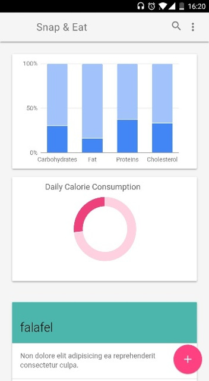

# Snap & Eat (formerly deep139)
Deep Learning Hackathon 48h - Cotidiano (**First place Project =D** )

We believe nutrition tracking should be as simple as taking a picture.

Snap & Eat is a web application that tracks the user's food intake by pictures. We use state-of-the-art deep learning techniques to recognize dishes, making instant nutrition estimates from the user's meals.

The app also suggests meals based on the user's income, and is capable of showing places nearby that serve those dishes.

The system is implemented in Pytorch using [fastai lib](https://github.com/fastai/fastai), relying on Jupyter Notebooks for prototyping purposes. For the web app, we use Flask and Node.js.

## Demo




## Our model

We use an [Aggregated Residual Convolutional Neural Network](https://arxiv.org/abs/1611.05431) - ResNeXt-101 with 101 layers, pretrained on [ImageNet](http://www.image-net.org/) dataset. We finetune the model on [Food-101 dataset](https://www.vision.ee.ethz.ch/datasets_extra/food-101/), with more than 100 thousand images of 101 types of dishes. We achieve a significant improvement on accuracy (71% in our work compared to 50.1% in [Bossard et al., 2014](http://www.vision.ee.ethz.ch/~lbossard/bossard_eccv14_food-101.pdf)).

 

For recomending new dishes, we use minimum ditance in an n-dimensional space of nutritional information that describe each dish.

## Installation and usage

### AWS AMI (Amazon Machine Images)

We provide a ready-to-go AMI of a p2 instance on AWS with all libraries and dependencies installed. 

| | | |
|-|-|-|
|__AMI ID__| ami-99442ee3 |
|__AMI Name__| snap-n-eat-ami |
||||

To launch an instance based on an AMI, see the [AWS Reference](https://aws.amazon.com/premiumsupport/knowledge-center/launch-instance-custom-ami/). Don't forget to git pull to get the the latest version of the code!

```sh
cd snapandeat
git pull origin master
```
 
To run all the services, the following four comands need to be run in the AWS instance, once in the ```snapandeat``` directory. We recommend using [tmux](https://github.com/tmux/tmux/wiki) to organize the terminals.

```sh
python src/services/food_predictor.py
```

```sh
python src/services/food_descriptor.py
```

```sh
python src/services/top_food.py
```

```sh
node src/webapp/server.js
```

To view and edit the Jupyter Notebooks, execute:

```sh
cd /home/ubuntu/snapandeat/src/notebooks
jupyter-notebook --no-browser --ip='*'
```

The default password for the notebooks is ```snapneat```. Don't forget to change it!

## About the idea

According to the [World Health Organization](http://www.who.int/en/), worldwide obesity has nearly tripled since 1975. In the United States, almost 75% of the population is overweight and more than half of the population is obese ([OECD](http://www.oecd.org/)). Today, many diseases that were preivously thought as hereditary are now shown to be seen conected to biological disfunction related to nutrition.

Although being healty and eating better is something the vast majority of the population want, doing so usually requires great effort and organization. The lack of an easy and simple way to track nutrition information about the food you eat can easily lead to low engagement. By providing a very easy and fun way to keep track of what the user eat, we can largely improve engagement, and directly atack on of the largest health problems in the world.